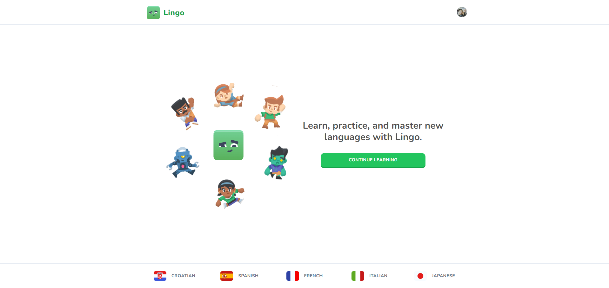
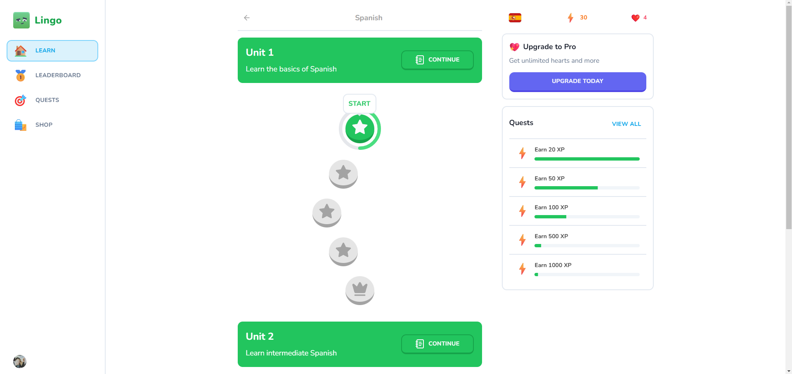

# Lingo - The world's best way to learn a language 🌍

<br>

<p align="center">
  <a href="#-about-the-project">About the project</a> •
  <a href="#-technologies">Technologies</a> •
<a href="#-getting-started">Getting started</a> •
<a href="#-license">License</a>

</p>

<p align="center">
 
 
  


</p>

## 👩‍💻 About the project

Lingo is a gamified language learning platform, inspired by the success of Duolingo. Developed using cutting-edge technologies like Next.js, Clerk, Stripe, Drizzle, and more.

With Lingo, you can create profiles for different languages, each featuring its own chapters and challenges. The platform incorporates a Points/XP system and hearts, reflecting users' progress and attempts. Additionally, it boasts a leaderboard for friendly competitions and an integrated store system powered by Stripe. This allows users to purchase hearts or upgrade to PRO plans, offering exclusive benefits.

Prepare to immerse yourself in a captivating language learning journey with Lingo!

[click here, see closer](https://lingo-cs.vercel.app/) 😉

## 🚀 Technologies

- [AI Voices with Elevenlabs AI](https://elevenlabs.io/)
- [Assets/mascot from kenney](https://kenney.nl/)
- [Clerk auth](https://clerk.com/)
- [Drizzle ORM](https://orm.drizzle.team/)
- [Neon](https://neon.tech/)
- [NextJs 14+](https://nextjs.org/)
- [PostgreSQL](https://www.postgresql.org/)
- [Shadcn/UI](https://ui.shadcn.com/)
- [Stripe](https://stripe.com/br)
- [Tailwind Css](https://tailwindcss.com/)
- [Zod](https://github.com/colinhacks/zod)
- [Zustand](https://zustand-demo.pmnd.rs/)

## 💻 Getting started

### Requirements

- [Node.js](https://nodejs.org/en/)
- [Yarn](https://classic.yarnpkg.com/) or [PNPM](https://pnpm.io/) _(examples are with PNPM)_

**Clone the project and access the folder**

```bash
$ git clone https://github.com/leandrorodrigues00/lingo && cd lingo

```

**Follow the steps below**

```bash
# Install the dependencies
$ pnpm i

# Make a copy of '.env.example' to '.env'
# and set with YOUR environment variables.
$ cp .env.example .env

# Start the app
$ pnpm run dev
```

## 📝 License

This project is licensed under the MIT License - see the [LICENSE](LICENSE) file for details.

---

<p align="center">
  Made with 💜&nbsp; by  Leandro Rodrigues
</p>
